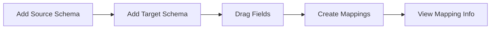

# KETL Project Documentation

## Table of Contents
1. [Overview](#overview)
2. [Project Structure](#project-structure)
3. [Key Features](#key-features)
4. [Technical Details](#technical-details)
5. [Current Implementation Status](#current-implementation-status)
6. [Development Guidelines](#development-guidelines)
7. [Additional Implementation Details](#additional-implementation-details)
8. [Troubleshooting](#troubleshooting)
9. [API Reference](#api-reference)
10. [Security & Performance](#security--performance)

## Overview
KETL is a data integration and transformation tool that provides features for:
- Data mapping between different schemas
- Data visualization
- Connection management (API, Database, SFTP)
- JSON data flattening and transformation

## Project Structure

### Core Components
1. **Layout**
   - Location: `src/components/layout/Layout.tsx`
   - Purpose: Main application layout with navigation
   - Features:
     - Responsive drawer navigation
     - Top app bar
     - Navigation menu items

2. **Data Mapper**
   - Location: `src/pages/DataMapping.tsx`
   - Purpose: Visual mapping between source and target schemas
   - Features:
     - Drag-and-drop field mapping
     - Visual connection lines
     - Mapping information panel
     - Schema tables

3. **Data Visualizer**
   - Location: `src/pages/DataVisualiser.tsx`
   - Purpose: Data transformation and visualization
   - Features:
     - JSON flattening
     - Column definitions
     - Data grid display
     - Connection integration

4. **Connections**
   - Location: `src/components/connections/ConnectionCard.tsx`
   - Purpose: Manage different data source connections
   - Types:
     - API connections
     - Database connections
     - SFTP connections

### Context Providers

1. **Schema Context**
   - Location: `src/context/SchemaContext.tsx`
   - Purpose: Manages schema state across components
   - Features:
     - Source schema management
     - Destination schema management
     - Schema dialog state

2. **Connection Context**
   - Purpose: Manages connection configurations
   - Features:
     - Connection CRUD operations
     - Connection state management

## Key Features

### 1. Data Mapping
- Visual drag-and-drop interface
- Real-time connection lines
- Schema validation
- Mapping information panel
- Source and target schema display

### 2. Data Visualization
- JSON structure flattening
- Custom column definitions
- Data preview
- Connection integration
- Error handling

### 3. Connection Management
- Multiple connection types support
- Connection testing
- Secure credential storage
- Connection status monitoring

## Technical Details

### State Management
- React Context for global state
- Local state for component-specific data
- Custom hooks for reusable logic

### UI Components
- Material-UI (MUI) for component library
- Custom styled components
- Responsive design patterns

### Data Flow
1. Connection selection
2. Data fetching
3. Schema generation
4. Mapping/Transformation
5. Result visualization

### Component Hierarchy
```
App
├── Layout
│   ├── Navigation
│   └── Main Content
├── DataMapping
│   ├── SchemaTable (Source)
│   ├── SchemaTable (Target)
│   └── MappingInfo
└── DataVisualizer
    ├── ConnectionSelector
    ├── ColumnDefinitionEditor
    └── ResultGrid
```

## Current Implementation Status

### Active Features
1. **Data Mapper**
   ```typescript
   // Key functions:
   handleDragStart() // Initiates mapping
   handleDrop() // Completes mapping
   generatePath() // Creates SVG path for visual connections
   updateMappingPositions() // Handles window resize
   ```

2. **Data Visualizer**
   ```typescript
   // Core functionality:
   getValueFromPath() // Extracts values from JSON
   parsePath() // Parses column definitions
   processResponseData() // Transforms data for grid
   ```

3. **Schema Context**
   ```typescript
   // Main state:
   sourceSchema: Schema | null
   destSchema: Schema | null
   openDialog: DialogType
   ```

### Current Workflow


### Known Limitations
1. Data Mapper
   - No support for many-to-one mappings
   - No transformation rules yet
   - Mappings reset on page refresh

2. Data Visualizer
   - Limited to JSON data currently
   - No data export feature
   - Column definitions need manual entry

## Development Guidelines

### Adding New Features
1. Create component in appropriate directory
2. Add to routing if needed
3. Update context if required
4. Add error handling
5. Update documentation

### Code Style
```typescript
// Template for new components
import React from 'react';
import { Box, Typography } from '@mui/material';

interface ComponentProps {
  // Props definition
}

export const Component: React.FC<ComponentProps> = ({ prop1, prop2 }) => {
  // State management
  // Effects
  // Helper functions
  // Return JSX
};
```

### Naming Conventions
- Handlers: handle[Event]
- Callbacks: on[Event]
- States: [noun]State
- Refs: [noun]Ref

## Additional Implementation Details

### Custom Hooks and Utilities
```typescript
// useSchemas Hook
const { sourceSchema, destSchema, setOpenDialog } = useSchemas();

// Mapping Line Calculations
const getElementCenter = (element: HTMLElement, side: 'source' | 'target') => {
  // Returns coordinates for SVG line connections
};
```

### JSON Flattener Syntax
```typescript
// Basic node access
{"NodeName"}.{"SubNode"}

// Array access
{"array"}[0]

// Wildcard
NodeName.*

// Multiple columns
Column1 = Path1
Column2 = Path2
```

### Critical Implementation Notes
1. **SVG Layer Management**
   - SVG must cover entire mapping area
   - Z-index handling for proper interaction
   - Window resize handling crucial

2. **Schema Handling**
   - Schema validation before mapping
   - Field type compatibility checks
   - Schema persistence strategy

## Troubleshooting

### Common Issues
1. Connection failures
   - Check credentials
   - Verify network access
   - Validate connection string

2. Mapping issues
   - Verify schema compatibility
   - Check browser console
   - Validate mapping rules

### Emergency Fixes
If mappings disappear:
1. Check window resize event listeners
2. Verify SVG container dimensions
3. Force updateMappingPositions()

## API Reference

### Connection Endpoints
```typescript
// API Connection
POST /api/connections/test
POST /api/connections/create
GET /api/connections/list

// Database Connection
POST /api/database/query
POST /api/database/test

// SFTP Connection
POST /api/sftp/list
POST /api/sftp/test
```

### Required Setup
```bash
# Required environment variables
REACT_APP_API_BASE_URL=http://localhost:5173
REACT_APP_API_KEY=your_api_key
REACT_APP_DEBUG_MODE=false
REACT_APP_VERSION=1.0.0
```

## Security & Performance

### Security Considerations
1. Secure credential storage
2. API key management
3. Connection encryption
4. Data validation
5. Error message sanitization

### Performance Optimization
1. Lazy loading
2. Memoization
3. Virtual scrolling
4. Batch processing
5. Caching strategies

### Future Enhancements
1. Additional connection types
2. Advanced transformation features
3. Batch processing
4. Export/Import mappings
5. Real-time data preview

## Development Environment Setup

### Prerequisites
```bash
Node.js >= 16.0.0
npm >= 8.0.0
Git
```

### Local Setup Steps
1. Clone repository
2. Install dependencies:
```bash
npm install
```
3. Create .env file:
```env
REACT_APP_API_BASE_URL=http://localhost:5173
REACT_APP_API_KEY=your_api_key
```

## Key Implementation Details

### SVG Line Drawing Logic
```typescript
// Critical function for mapping lines
const generatePath = (start: Point, end: Point) => {
  const controlPoint1X = start.x + (end.x - start.x) / 2;
  const controlPoint2X = controlPoint1X;
  return `M ${start.x} ${start.y} 
          C ${controlPoint1X} ${start.y},
            ${controlPoint2X} ${end.y},
            ${end.x} ${end.y}`;
};
```

### Schema Structure
```typescript
interface Schema {
  id: string;
  name: string;
  columns: {
    id: string;
    name: string;
    type: string;
  }[];
}
```

### Mapping Structure
```typescript
interface Mapping {
  sourceId: string;
  targetId: string;
  startPoint: { x: number; y: number };
  endPoint: { x: number; y: number };
}
```

## Debug Mode

### Enabling Debug Information
```typescript
// Currently commented out in DataVisualiser.tsx
/* Debug Information Section
{process.env.NODE_ENV === 'development' && response && (
  <Paper sx={{ p: 2, mt: 2, bgcolor: '#f5f5f5' }}>
    <Typography variant="subtitle2" gutterBottom>
      Debug Information
    </Typography>
    <Box component="pre" sx={{ fontSize: '0.8rem', overflow: 'auto' }}>
      {JSON.stringify({
        columnDefs: parseColumnDefinitions(editorContent),
        samplePath: response ? getValueFromPath(response, '{"Time Series (Daily)"}.InnerNode1') : null,
        parsedRows: parsedData?.rows
      }, null, 2)}
    </Box>
  </Paper>
)}
*/
```

## Current Project Status (As of Last Update)

### Implemented Features
- Basic layout with navigation drawer
- Schema mapping with drag-and-drop
- Connection management UI
- JSON data visualization
- Basic error handling

### Pending Features
- Connection testing implementation
- Data transformation rules
- Mapping persistence
- Export/Import functionality
- Advanced error handling

### Known Issues
1. Schema Context
   ```typescript
   // Need to handle edge cases in SchemaContext
   const handleSaveSchema = (schemaData: { 
     name: string; 
     columns: any[]; 
     schemaType: DialogType 
   }) => {
     // Current implementation needs type validation
   };
   ```

2. Mapping Lines
   ```typescript
   // Window resize issues
   useEffect(() => {
     const handleResize = () => {
       updateMappingPositions();
     };
     window.addEventListener('resize', handleResize);
     return () => window.removeEventListener('resize', handleResize);
   }, [mappings]);
   ```

## Testing Guidelines

### Unit Tests Needed
1. Schema validation
```typescript
describe('Schema Validation', () => {
  test('should validate schema structure', () => {
    // Test schema structure validation
  });
  test('should validate column types', () => {
    // Test column type validation
  });
});
```

2. Mapping logic
```typescript
describe('Mapping Logic', () => {
  test('should create valid mapping', () => {
    // Test mapping creation
  });
  test('should update mapping positions', () => {
    // Test position updates
  });
});
```

## File Structure
```
src/
├── components/
│   ├── layout/
│   │   └── Layout.tsx
│   ├── mapping/
│   │   └── SchemaTable.tsx
│   └── connections/
│       └── ConnectionCard.tsx
├── context/
│   ├── SchemaContext.tsx
│   └── ConnectionContext.tsx
├── pages/
│   ├── DataMapping.tsx
│   └── DataVisualiser.tsx
└── types/
    └── schema.ts
```

## Quick Reference

### Common Operations
1. Adding new schema:
```typescript
const { handleSaveSchema } = useSchemas();
handleSaveSchema({
  name: 'New Schema',
  columns: [],
  schemaType: 'source'
});
```

2. Creating mapping:
```typescript
setMappings(prev => [...prev, {
  sourceId: 'source_id',
  targetId: 'target_id',
  startPoint: { x: 0, y: 0 },
  endPoint: { x: 0, y: 0 }
}]);
```

### Useful Commands
```bash
# Development
npm run dev

# Build
npm run build

# Test
npm run test

# Lint
npm run lint
```

### Important Notes
1. Always update mapping positions after schema changes
2. Validate schemas before allowing mappings
3. Handle connection errors gracefully
4. Keep SVG layer properly sized
5. Maintain type safety throughout
